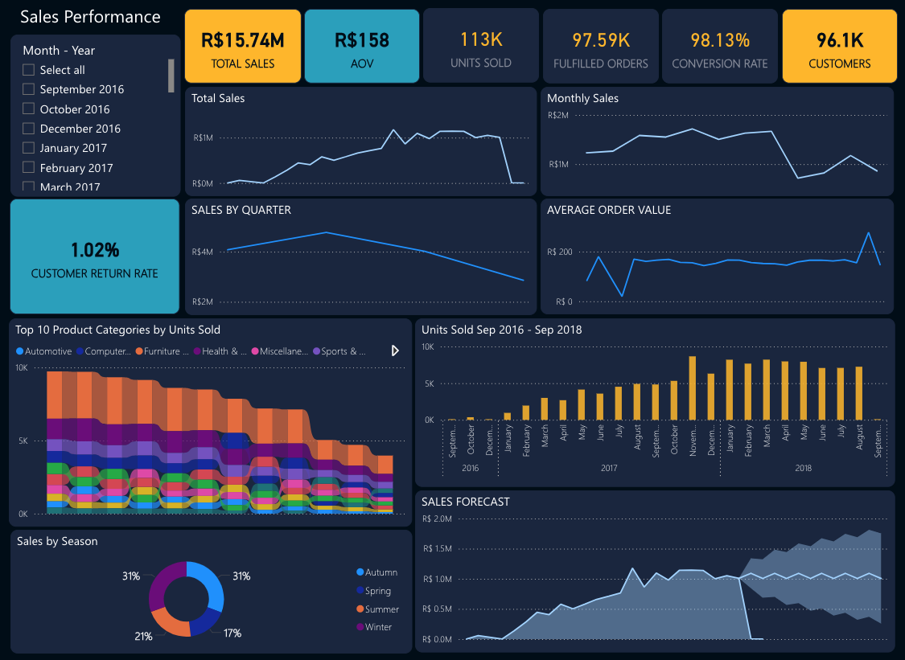
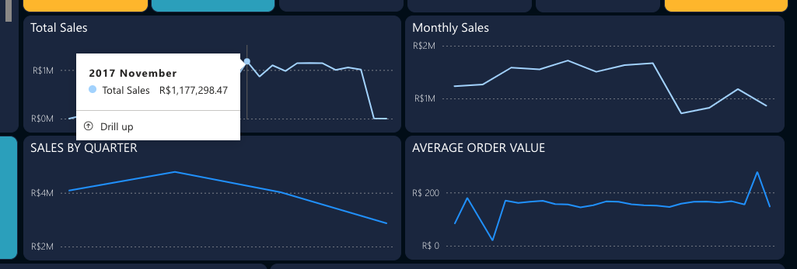
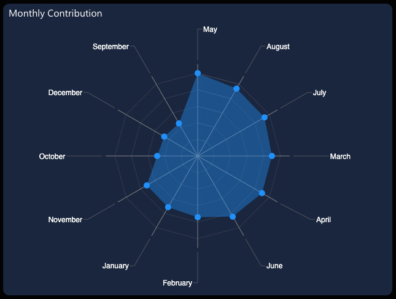
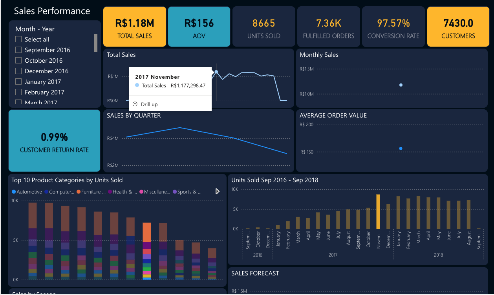
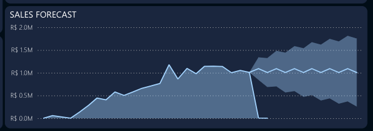
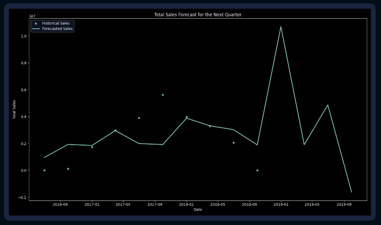
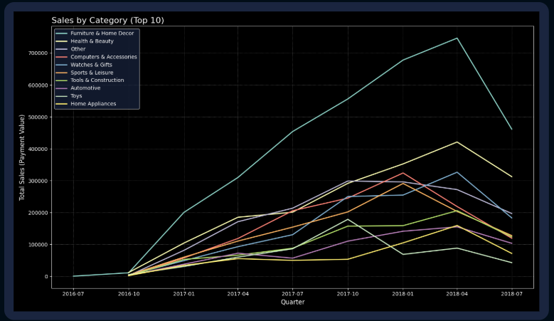
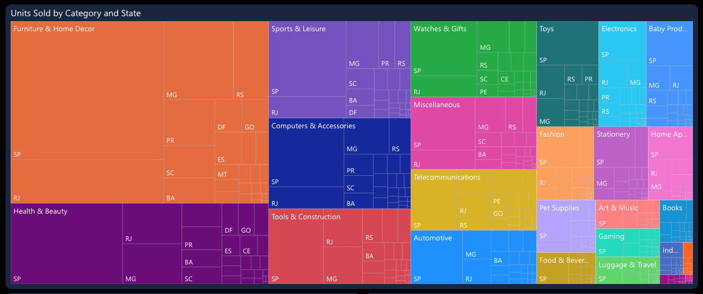

# **Olist Sales Dashboard – Advanced Business Intelligence & Predictive Insights**  

This project provides a **comprehensive analysis of Olist’s marketplace sales**, uncovering key trends, customer retention challenges, forecasting limitations, and product performance insights. By leveraging **Power BI, SQL, Python (Prophet, ARIMA, Clustering), and advanced DAX calculations**, this dashboard transforms raw sales data into a **strategic decision-making tool**.  

---

## Dashboard Overview  
  

This **interactive Power BI dashboard** allows users to explore key business metrics such as:  
- **Total Sales** - Measuring revenue fluctuations over time  
- **Customer Return Rate** - Identifying repeat purchase behaviours  
- **Conversion Rate** - Evaluating sales funnel efficiency  
- **Product Performance** - Analysing best-selling categories  
- **Forecasting & Trends** - Predicting future sales patterns  

**Immediate Insights:**  
- **Total Sales: R$15.74M**, with a peak in **November**  
- **Low customer retention (1.02%)**, significantly below industry standards  
- **Furniture & Home Décor dominates sales**, but underperforming categories present growth opportunities  
- **Forecasting inaccuracies suggest model overfitting due to missing data**  

---

## Key Insights & Visual Analysis  

### **1. Why Did November 2017 Have the Highest Sales?**

**Key Insight:**  
- **November 2017 had the highest recorded sales (R$1,177,298.47)**, significantly outperforming other months.  
- This peak **aligns with Black Friday promotions**, indicating that **discounts and promotional campaigns played a major role in driving revenue**.  

**November 2017 Sales Analysis**  
  

**Potential Factors Behind November 2017’s Sales Peak:**  
- **Black Friday Influence** – Heavy discounts attracted more buyers.  
- **Holiday Season Kick-Off** – Early Christmas shopping boosted purchases.  
- **Higher Conversion Rates** – Promotions and urgency likely improved checkouts.  
- **Marketing & Campaign Timing** – Pre-Black Friday campaigns played a key role.  

**Strategies to Increase Sales in Other Months:**  
- **Replicate Black Friday Promotions in Other Shopping Seasons** –  
  - Focus on **May (Mother’s Day), August (Back-to-School), and December (Christmas)**.  
- **Leverage AI for Dynamic Pricing Optimisation** –  
  - Implement **real-time price elasticity models** to adjust pricing based on demand.  
- **Enhance Product Bundling & Upselling Techniques** –  
  - Use **Market Basket Analysis** to recommend complementary products.  

**Monthly Contribution Breakdown**  
  

**Observation:**  
- **May and August also demonstrated strong sales contributions**, requiring further marketing efforts.  
- **February saw unexpected spikes**, possibly from **Valentine’s Day promotions**.  

---

### **2. Seasonal Sales Trends & Opportunities**

**Key Insight:**  
- **Q4 consistently outperforms other quarters**, highlighting seasonal demand surges.  
- **Sales drop by ~50% in Spring & Summer**, signalling missed revenue opportunities.  

**Sales Performance by Quarter**  
  

**Strategic Enhancements:**  
- **AI-Powered Demand Forecasting** – Use **Prophet, ARIMA, and LSTM neural networks** for optimised predictions.  
- **Extend Seasonal Campaigns to Spring & Summer** – Counteract the decline in these periods with promotional events.  
- **Pre-Holiday Engagement Strategies** – Implement **email marketing and targeted ads** before high-demand months.  

---

### **3. Forecasting Challenges & Improvements**

**Key Issue:**  
- The **Prophet model produced unreliable forecasts** with **sharp spikes and sudden declines**.  
- **Post-2018 sales drop-off suggests missing data issues** affecting long-term trends.  

**Sales Forecasting Trends**  
  

**Total Sales Forecast for Next Quarter**  
  

**Why Prophet Performed Poorly:**  
- **Overfitting to Noise** – Prophet is **sensitive to missing data and outliers**, distorting trend detection.  
- **No External Variables Considered** – Prophet lacks the ability to factor in **marketing campaigns, competitor pricing, and economic trends**.  
- **Missing Data Post-2018** – This weakened the model’s ability to detect recurring seasonality.  

**Better Forecasting Models for Future Analysis:**  
- **SARIMA for Improved Seasonality Handling**  
- **LSTM (Deep Learning) for Detecting Long-Term Trends**  
- **XGBoost for Event-Based Demand Forecasting**  

---

### **4. Customer Retention Challenges**

**Key Issue:**  
- **Customer return rate is critically low at 1.02%**, compared to **27% (Shopify industry benchmark)**.  
- Olist **relies too heavily on first-time buyers**, rather than cultivating repeat purchases.  

**Retention Challenges**  
  

**Strategic Actions to Improve Retention:**  
- **Implement Loyalty Programmes & Personalised Discounts**  
- **Leverage AI-Powered Customer Segmentation (K-Means Clustering)**  
- **Enhance Post-Purchase Engagement via Targeted Emails**  

---

### **5. Product Performance & Market Expansion**

**Product Category Insights:**  
- **Furniture & Home Décor dominates revenue**, while **Toys & Automotive struggle**.  
- **Mid-range priced products (~R$59.90) perform better than lower-end items (~R$20 and below)**.  

**Sales by Product Category**  
  

**Regional Demand by Category**  
  

**AI-Driven Market Expansion Strategies:**  
- **Market Basket Analysis to Identify Best Product Pairings**  
- **Geo-Targeted Ads for Underserved Regions**  
- **AI-Based Inventory Optimisation for Demand Forecasting**  

---

### **6. Data Science Enhancements & Future Analysis Recommendations**

**How I Can Improve My Future Analysis as a Data Analyst:**  
- **Leverage Machine Learning for Customer Segmentation** (K-Means, DBSCAN)  
- **Develop Predictive Models for High-Value Customer Identification**  
- **Use A/B Testing to Optimise Promotions & Checkout Processes**  
- **Perform Sentiment Analysis on Customer Reviews (NLP-based insights)**  
- **Build an Automated BI Dashboard for Continuous Monitoring**  

---

## Revenue Opportunities & Strategic Takeaways  

**Potential Additional Revenue: R$2.5M - R$3.9M**  

**Key Growth Strategies for Olist:**  
- **Optimise Seasonal Marketing (R$700K–R$1M)**  
- **Improve Customer Retention (R$600K–R$1M)**  
- **Expand High-Performing Product Categories (R$500K–R$800K)**  
- **Increase Regional Market Penetration (R$400K–R$600K)**  
- **Refine Forecasting Models & AI-Powered Pricing (R$300K–R$500K)**  

**Strategic Quarterly Performance Overview**  
  

---

## Next Steps & Enhancements  

- **Integrate Website Tracking for Better Conversion Rate Analysis**  
- **Refine Forecasting Models Using Hybrid ML Techniques**  
- **Expand Customer Segmentation with AI-Driven Clustering**  
- **Deploy Advanced Predictive Analytics for Dynamic Pricing**  

This project highlights my ability to **turn complex datasets into strategic insights that drive revenue growth and operational efficiency**.  

---

**Interested in collaborating? Let’s connect!**  
[mashasesa@gmail.com](mailto:mashasesa@gmail.com) | [LinkedIn](https://www.linkedin.com/in/mashaesa)  